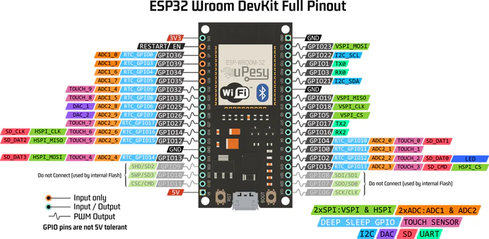
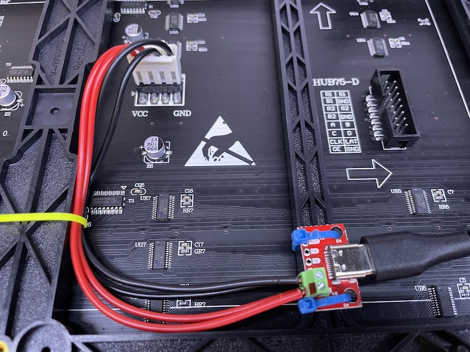
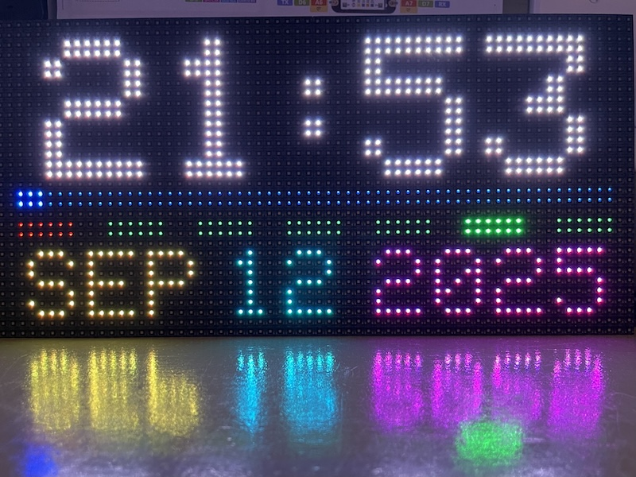

# Dot Matrix Clock

In this project, we are making a clock that displays the time and date on a 64x32 dot matrix panel. The clock is powered by an ESP32 microcontroller. The time is calibrated by NTP servers over Internet. 
<!-- Optionally, we can use an RTC module to keep the time when the microcontroller is unplugged or during power outages. -->

## Basic clock
Let's first make a basic clock that displays time and date, without bells and whistles.

### Microcontroller
Since we want to sync time with NTP servers, we need a microcontroller with WiFi capabilities. ESP32 is a natrual choice. We also need enough pins to drive the dot matrix panel. I have a few ESP32-WROOM dev boards and let's use one of them. It's important is to choose the correct board in Arduino IDE. "ESP32 Dev Module" should work fine. Unlike Arduino Leonardo you have used before, ESP32 is supported by Arduino IDE via a "Board Manager" that you need to install yourself. Have a quick read of this [tutorial](https://randomnerdtutorials.com/installing-the-esp32-board-in-arduino-ide-windows-instructions/) on how to do that.

There are many different dev boards based on ESP32. The one you received is a 38 pin Wroom. Here's a pinout diagram. Note that the USB port is at the bottom. Make sure you orient the board correctly.

### Dot Matrix Panel
As a first step, let's make sure we are able to hook up the panel to the ESP32 and display some text. This is very similar to the [happy birthday](https://github.com/delingren/happybirthday) exercise we did before. But the dot matrix panel has a few quirks of its own. Let's address them!

Most of these dot matrix panels are simply powered by HUB75 [shift registers](https://learn.sparkfun.com/tutorials/shift-registers/all) and are chainable to make bigger panels. I bought [this one](https://www.waveshare.com/wiki/RGB-Matrix-P5-64x32) from AliExpress. I'm not sure if it was a knock-off but it works and it's cheap.

To connect the panel to the ESP32, Let's use these connections, which have been proven to work.

| HUB75 | ESP32 |
|-----|-----|
| R1  | 25  |
| G1  | 26  |
| B1  | 27  |
| R2  | 14  |
| G2  | 12  |
| B2  | 13  |
| A   | 23  |
| B   | 19  |
| C   | 5   |
| D   | 17  |
| CLK | 16  |
| LAT | 4   |
| OE  | 15  |
| GND | GND |

Of the three `GND` pins on the panel, you only need to connect one of them. They are all connected internally. But it doesn't hurt to connect them all. Triple check your connections before powering up anything. Or you risk damaging the panel. Ask me how I know!

Unlike the tiny TFT display you have worked with before, this panel is much more power hungry and should not be powered by the USB port from your computer. Drawing too much current could damage your computer! Let's use an external 5V power supply. With my sketch, I measured about 400 mA going through the display panel. I have read that when all dots are at the maximum brightness, it could draw 3 Ampres. So let's use a laptop USB PD charger. USB PD provides up to 3 ampres at 5V. We are going to use a USB C breakout board with 5V [triggerd](https://learn.adafruit.com/usb-pd-hacks/things-to-know). Make sure you power up the panel before powering up the microcontroller, otherwise the panel will be in a weird state and won't display correctly.

To drive the panel, I found two libraries, both Adafruit GFX compatible. They are both available in the Library Manager of Arduino IDE.

* [Protomatter](https://docs.arduino.cc/libraries/adafruit-protomatter/)
* [ESP32 HUB75 LED MATRIX PANEL DMA Display](https://docs.arduino.cc/libraries/esp32-hub75-led-matrix-panel-dma-display/)

The latter seems to cause some flickering. I eliminated connection issues. Maybe dma is just finicky? Anyway, since Protomatter seems to work fine, I didn't press. So let's use the Protomatter library for now. Recall the Arduino GFX library you used for displaying the happy birthday message? This library is basically used the same way! The only thing that's a little different is, you have to call `.show()` at the end to update the display. Before that, everything is only drawn in memory.

### WiFi
Connecting an ESP32 to a WiFi network is rather straight-forward. Here is a good [tutorial](https://randomnerdtutorials.com/esp32-useful-wi-fi-functions-arduino/) on this topic. It's quite comprehensive and if you don't understand much of it, it's totally fine. You don't need most the stuff to finish this project. All you need is three APIs: `mode()`, `begin()`, and `status()`.

Check out the [code example](./esp32-protomatter/).

### NTP
Now, the next challenge is to get the actual time. The reason your computer can keep an accurate time is due to two factors:

* It has an internal clock.
* It synchronizes the clock with the Internet once in a while, to calibrate the internal clock.

Microcontrollers have internal clocks too. However, they don't know the actual time. They only know the time since they were powered on! This is like knowing that you are 11 years old, but not knowing what year it is right now. But if you can ask your parents your birth year, you can also deduce the current year. Similarly, with an Internet connection, we can sync our time with NTP servers and figure out the real time. NTP is a protocol for any Internet device to obtain the real time from a server. There are thousands of such servers around the world. The details of how they work are not critical. We are simply concerned with how to syncrhonize the time with these servers. Once syncrhonized, the internal clock of the microcontroller will keep the time. Like any ordinary clock, and unlike the super accurate clocks used by those NTP servers, the internal clock drifts a little over time. Usually not a lot, but it adds up, especially if we plan to run this thing forever! So we should occasionally calibrate our time with the servers, say, once a day.

Here is a [tutorial](https://lastminuteengineers.com/esp32-ntp-server-date-time-tutorial/) on working with NTP on ESP32. Check out the [code example](./esp32-ntp/) on syncing with NTP.

### Interrupts!

Now, we want to introduce a very important concept in all things computer related. Interrupts! So far, all your Arduino code has been 'linear', meaning you do one thing at a time, then move on to the next. If you want to control the timing, you use `delay()`. Although this is useful, it has its limitations. It's very hard to control the exact timing. In our case, we want to update our display exactly once a second. Not 900 ms, not 1100 ms, exactly 1000 ms. `delay(1000)` won't work well here, because you don't know how long your code in `loop()` takes to run. Fortunately, there is another way to precisely control timing. We can set an alarm clock. Once it expires, it runs a piece of code, called an interupt handler or interupt service routine. Take a look at this [code example](./esp32-timer/) to learn how to set up a repeating alarm clock that fires once a second.

Pay attention to a digital clock. Normally, it updates the display once a second. In addition, if flashes the colon between hour and minute once a second too, turning it on and off. Here is a [code example](./esp32-flash/) demonstrating the concept.

### Putting it together

Now we have all the necessary hardware and software. It's time to put everything together on a breadboard, and write the code to display the time and date! The code examples listed above should have all the APIs you need. You might want to take advantage of `Adafruit_Protomatter::printf()` as well.

<!-- ## RTC module

Don't worry about this section until everything else is working. If you're done with everything else, let's improve it by adding an RTC module so that we can keep the time even when the microcontrolled is not powered on.

An RTC module is a simple device that keeps time with a button battery. We are going to use a *DS3231* RTC module. Here is a [tutorial](https://randomnerdtutorials.com/esp32-ds3231-real-time-clock-arduino/#intro-rtc) on how to interact with an RTC module on an ESP32. -->

## Assembly

Once you have written the code and verified everything on a breadboard, let's solder up everything on a perf board, mount it on the back, and make a hanger so that you can hang it on your window for passersby to see your work!

